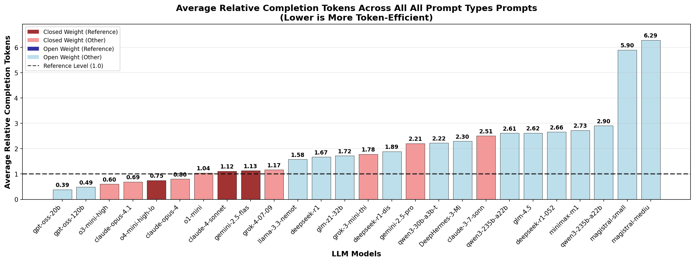

# LRM Token Economy

An analysis of token efficiency in Large Reasoning Models (LRMs), investigating whether open-weight models systematically require more tokens than closed-weight models for comparable reasoning tasks.

**The complete analysis and findings are detailed in the [research report](report/report.md).**

<div align="center">

</div>

## Overview

This repository contains the pipeline used to generate the data and figures for our analysis of token efficiency patterns across different categories of large language models. 

## Repository Structure

```
LRMTokenEconomy/
├── data/
│   ├── detailed_evaluations_*.json    # Detailed model evaluation results
│   ├── evaluation_summary_*.json      # Summary statistics per model
│   └── output_queries_*.json          # Query results and token usage data
├── evalset/                           # Evaluation prompts and test cases
├── figures/                           # Generated figures and charts
├── report/
│   ├── images/                        # Report figures and charts
│   └── report.md                      # Final analysis report
├── analyze_*.py                       # Analysis and visualization scripts
├── query-script*.py                   # Model querying scripts
├── evaluation-script.py               # Evaluation processing
├── aggregate_results.py               # Results aggregation
├── evaluation_stats.csv               # aggregated evaluation statistics
└── model_prices.csv                   # Model pricing data (auto-generated)
```
## Installation

Clone the repository and install dependencies:

```bash
git clone https://github.com/cpldcpu/LRMTokenEconomy.git
cd LRMTokenEconomy
pip install -r requirements.txt
```
For running new evaluations, you'll need API credentials for OpenRouter and Google AI (for Gemini models).

## Usage

### Generating Analysis Figures

The repository includes several analysis scripts to reproduce the figures used in the research:

```bash
# Token efficiency analysis
python analyze_prompts.py --types knowledge,logic_puzzle,math --output-dir figures/eco_all
python analyze_prompts.py --types knowledge --output-dir figures/eco_knowledge

# Cost and other analyses
python analyze_cost.py --input model_prices.csv --output-dir figures/cost
python analyze_cot_transcription.py --output-dir figures/cot_transcription
python analyze_model_trends.py --output-dir figures/trends_eco_all
python analyze_wordstats.py --output-dir figures/wordstatistic
```
Use the `--help` command line flag with each script to see available options and configurations.

### Running New Evaluations

```bash
# Query models and evaluate results
python query-script.py --config query_config.json 
python evaluation-script.py --input data/output_queries_batch.json 
python aggregate_results.py
```

Configuration files include `query_config.json` (main configuration), `query_config_full.json` (full model evaluation), and `query_config_recent.json` (recent models only).

## Citation

If you use this research or data in your work, please cite:

```bibtex
@misc{lrm_token_economy_2025,
  title={Do Open Weight Reasoning Models Think Less Efficiently?},
  author={[Tim](https://github.com/cpldcpu/)},
  year={2025},
  month={August},
  url={https://github.com/cpldcpu/LRMTokenEconomy}
}
```