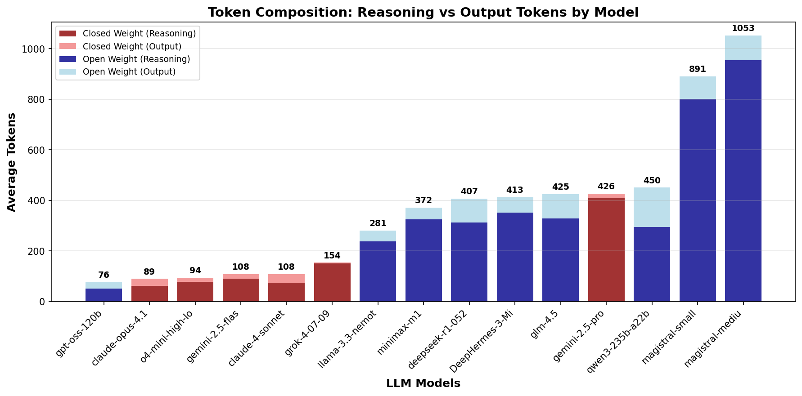
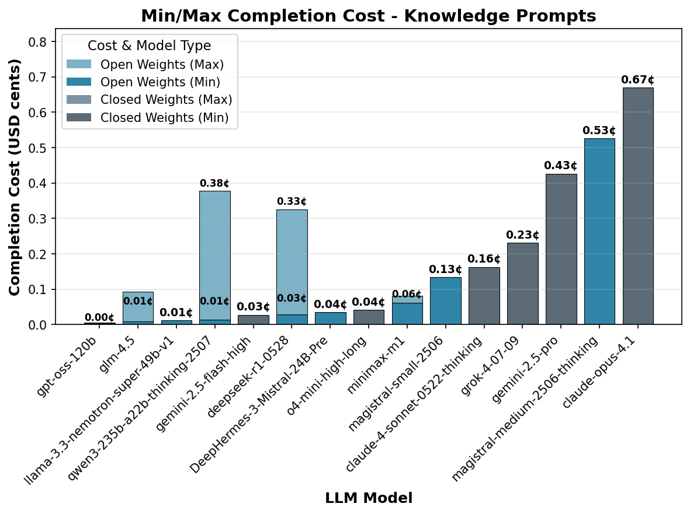
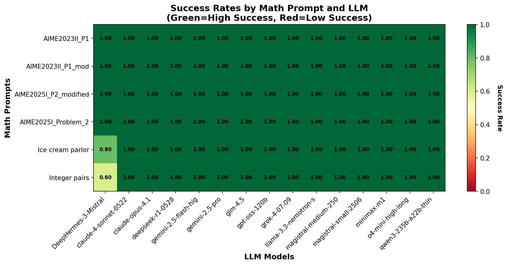
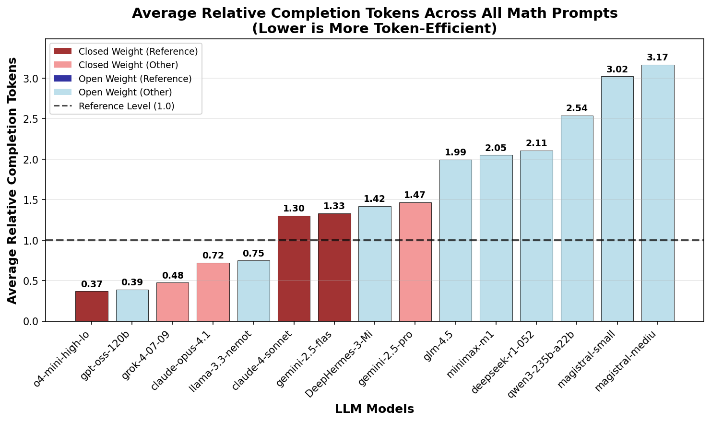
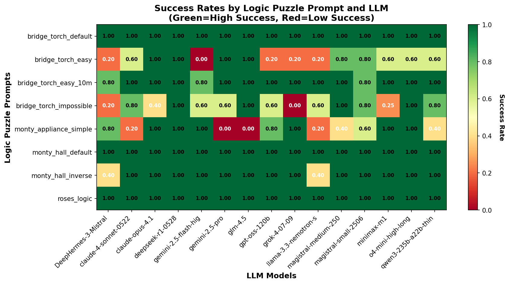
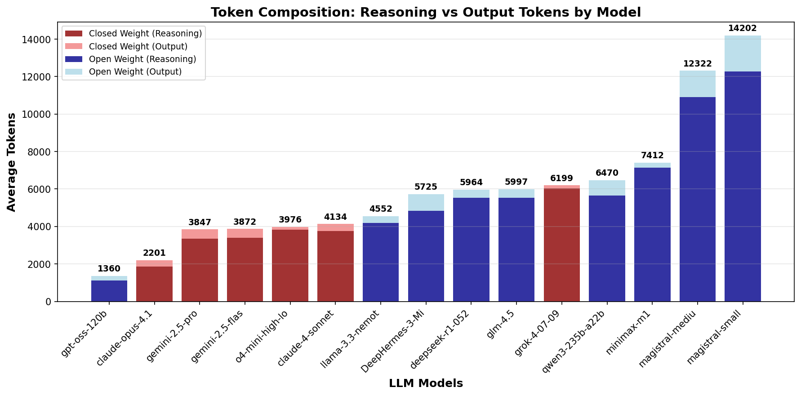
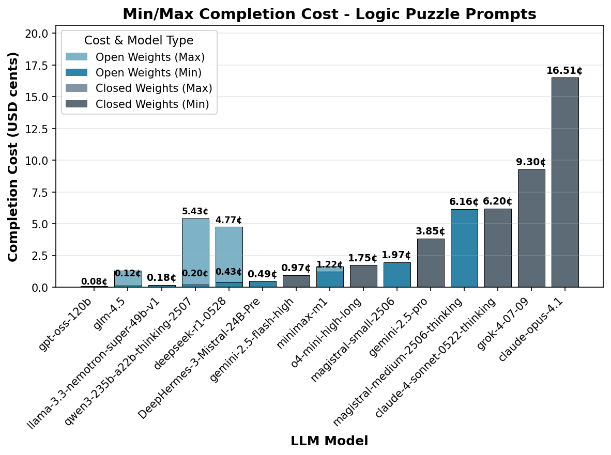

# Do Open Weight Reasoning Models Think Less Efficiently?

Large Reasoning Models (LRMs) employ a novel paradigm known as test-time scaling, leveraging reinforcement learning to teach the models to generate extended chains of thought (CoT) during reasoning tasks. This enhances their problem-solving capabilities beyond what their base models could achieve independently.

While cost and efficiency trade off curves  ("the pareto frontier") typically focus on model intelligence versus cost per million completion tokens, token efficiency — the number of tokens used for reasoning relative to the solution — is a critical factor that is recently receiving more attention. 

Anecdotal evidence suggests open weight models produce significantly more tokens for similar tasks than closed weight models. 

This report systematically investigates these observations. We confirm this trend to be generally true, but observe significant differences depending on problem domain.

## Why is it of interest to measure token efficiency?

Token efficiency is a critical metric for several practical reasons:

First, while hosting open weight models may be cheaper, this cost advantage could be easily offset if they require more tokens to reason about a given problem. Second, an increased number of tokens will lead to longer generation times and increase latency. Finally, inefficient token usage may exhaust the available context window, limiting the model's ability to process complex queries effectively.

Our investigation addresses three key questions:

1. Do open weight models systematically require more tokens than closed weight models for comparable tasks?
2. What are the cost implications when token efficiency is factored into total inference expenses?
3. Are there specific task categories where this efficiency gap is more pronounced?

## How can we measure token efficiency? 

Measuring the length of the thinking process, the Chain-of-Thought, presents some issues, because most recent closed source models will not share their raw reasoning traces. The rationale behind this is prevent competitors from finetuning on their reasoning traces. Instead, they use smaller language models to transcribe the chain of thought into summaries or compressed representations. This means the original reasoning process remains hidden, with only the final answer and a transcribed version of the CoT available for analysis.

However, since models are usually billed by the number of output tokens for the full prompt completion (thinking and final answer output), we can use the number of completion tokens as a proxy for the total effort required to generate an answer.

To investigate which models transcribe the CoT and which make them directly available, we analyzed the relationship between total characters for completion (the sum of thinking trace and final output) versus the number of tokens billed for completion across all prompts in this study.

[Figure 1](#fig1) illustrates the relationship between total characters for completion (combining thinking trace and final output) versus the number of tokens billed for completion across all prompts in this study. Each model shows a linear relationship, but with different slopes depending on the specific model implementation.

[Figure 2](#fig2) presents the extracted slopes for each model, revealing interesting patterns. 

- **Open weight models** show a consistent character-to-token ratio of approximately 3-3.4, which is a typical token-to-character ratio of tokenizers. This suggests that no transcription took place for these models.
- **Claude 3.7 Sonnet** exhibits a ratio of 2.8, suggesting that the CoT is mostly intact, but the lower ratio my indicate that some filtering took place, possibly through simple word filtering or substitution.
- **Gemini models** show a slope of ~1, which suggests a text densification ratio of 3:1. While the original CoT is not available, the output remains proportional to chain of thought length and should reflect the reasoning process.
- **OpenAI and Claude models** show a ratio of 0.3, with closer examination of the scatter plot revealing that character count doesn't increase with CoT length, suggesting only a summary of the entire CoT is provided rather than transcription. This behavior seems to be specific to chat completions, as a continuous update is seen in streaming mode.

Some models also provide information about reasoning tokens as part of the API response. However, we found this number to be unreliable in many cases as some models (Claude) would only return the number of tokens of the transcribed CoT, while others would provide token counts that exceeded the total completion length. We introduced consistency checks to decide how to extract the reasoning token count, as described in the appendix.

Based on these findings, we use completion tokens to assess overall effort, supplemented by reasoning tokens from APIs where available.

## Dataset

To systematically evaluate token efficiency across different reasoning domains, we curated a dataset consisting of three categories:

- *Knowledge questions*: Can be answered in one sentence from the models pre-training corpus.
- *Math problems*: Math problems should exhibit the most optimized behavior of reasoning models.
- *Logic puzzles*: logic puzzles requires both semantic understanding and logical reasoning.

The questions were chosen to be solvable within the 30000 token limit to avoid truncated responses.

## Findings

### Knowledge questions

This part of the evaluation consists of 5 trivial knowledge questions that can be answered in one word and that do not require reasoning at all. E.g.

1) What is the capital of Australia?
2) How many days are there in February during a leap year?

All models were able to respond to these prompts correctly. The purpose of these questions is to probe for superfluous reasoning. Efficient models should be able to determine that no reasoning is required.

[Figure 3](#fig3) shows the average number of reasoning and output tokens for each prompt. We can see, that on average, reasoning models spend hundreds of tokens pondering simple knowledge questions.

 

Resolving this per model reveals stark differences. [Figure 4](#fig4) shows that closed-weight frontier lab models are far more token efficient than open weight models.

To better quantify the excess token ratio, we normalized the token count for each prompt relative to the most optimized closed weight models (reference). This approach does consider the excess token ratio for all prompt equally,  which is in contrast to averaging across all completion lengths, which would be dominated by long completions.

[Figure 5](#fig5) shows the mean excess token ratio for different llm. The recently released Magistral models are an extreme outlier with up to 10x excess tokens. We also see that most other open weight models show an excess token ratio of around 4, meaning that they use four times as many tokens as the most optimized closed weight models.

How does this affect inference costs? [Figure 6](#fig6) shows the mean cost per model for knowledge questions, based on minimum and maximum completion pricing on the OpenRouter API in July 2025. The better token efficiency of closed weight models often compensates for higher API pricing of those models.

 
### Math problems

Most reasoning models are specifically trained to solve mathematical problems. One reason for this is that math problems are usually easily verifiable, which is a key advantage for reinforcement learning. Furthermore, math problems are also an easy benchmark target for reasoning models as there are many widely available problem sets.

For this study, we selected a set of six problems to test token efficiency in the math domain. Three problems were sourced from [AIME](https://artofproblemsolving.com/wiki/index.php/American_Invitational_Mathematics_Examination) 2025, and one problem was taken from AIME 2023. Easier problems were chosen to prevent models from exceeding the 30000 token limit. To further investigate the role of memorization in problem-solving, we created two modified problems by changing the variables in one AIME 2025 problem and the AIME 2023 problem. The rationale behind this approach is that unknown problems may require a longer chain of thought, as the model cannot rely on memorized solutions. The AIME 2025 problems are too new to be in the pre-training data of any model, while some may have seen the AIME 2023 problems during pre-training. 

Example:

*AIME2025I Problem 2* (Original): **"Find the sum of all positive integers $n$ such that $n+2$ divides the product $3(n+3)(n^2+9).$"**
*AIME2025I Problem 2* (Modified): **"Find the sum of all positive integers $n$ such that $n+2$ divides the product $3(n+3)(n^2+7).$"**
 

With a few exceptions, all models were able to solve the math problems correctly [Figure 7](#fig7).

We can see that, on average, less than 10000 tokens are required to solve the selected problems ([Figure 8](#fig8)). The more complex problems from the AIME2025 set will easily require more than 30000 tokens in some models and were therefore not used for this evaluation to avoid skewing the distribution due to truncation.

Remarkably, the number of tokens required to solve the pairs of original and modified problems is almost identical. This could suggest two trends across all llms:
- These math problems are not solved based on memorization, but algorithmically.
- The number of tokens is identical for similar problems.
 

 

[Figure 9](#fig9) shows the relative excess token ratio compared to the reference. In contrast to the trends observed for knowledge questions, the relative ratio between models is much lower. `o4-mini-high-long` is a notable outlier with a surprisingly low token count — 3x fewer tokens than other commercial models. This suggests that o4-mini has been specifically optimized for token efficiency in mathematical problems. The recently released `grok-4` also seems to have been optimized for token efficiency in math problems. The most efficient open weight model is `llama-3.3-nemotron-super-49b-v1`, uses less tokens than most closed weight models. `magistral-small` and `magistral-medium` remain the highest token count models, but show only 3x the ratio of the reference models.

Generally, there is a very clear trend towards higher reasoning token usage for open weight models in math problem, compared to closed weight models. This may suggest an optimization toward benchmarking performance rather than production efficiency.

Examining completion costs reveals that since token consumption is relatively similar across most models for math problems, those with higher per-token pricing naturally incur the highest completion costs. However, the exceptional token efficiency of `o4-mini-high-long` enables it to achieve very competitive total completion costs despite potentially higher per-token rates, demonstrating how optimization can offset pricing disadvantages. 

### Logic puzzles

Logic puzzles are a curious domain for reasoning models. They require a combination of semantic understanding and logical reasoning, making them an interesting test case for evaluating reasoning capabilities. 

However, they also present a challenge: many well known logic puzzles are commonly found in pre-training data which will cause models to be over-fit on specific solutions. Non-reasoning models will often have difficulty recognizing small changes to logic problems and tend to answer them based on memorization of the original problem. The [misguided attention](https://github.com/cpldcpu/MisguidedAttention) evaluation dataset showcases this issue. Reasoning models can often overcome the bias of their pre-training data in the CoT and solve modified problems correctly.

The logic puzzle 

Our logic puzzle evaluation included eight different problems designed to test reasoning capabilities while avoiding memorization:

- **Bridge and torch problems** with varying constraints (impossible, easy, and standard versions)
- **Monty Hall variations** including both the classic problem and an inverse version

These problems were specifically chosen to require genuine logical reasoning rather than pattern matching from training data.

[Figure 10](#fig10) shows the success rates across different logic puzzle problems. Unlike the math problems, success rates vary significantly across both models and problem types. Some models struggle with certain logical reasoning tasks, particularly the more complex bridge and torch problems and Monty Hall variations.

[Figure 11](#fig11) reveals that logic puzzles generally require fewer tokens than math problems but more than knowledge questions. The token requirements vary significantly depending on the specific puzzle type, with bridge and torch problems typically requiring the most reasoning tokens.

Similar to the patterns observed in other categories, [Figure 12](#fig12) shows that open-weight models consistently use more tokens than closed-weight models for logic puzzles. However, the gap is less pronounced than in knowledge questions, suggesting that the reasoning complexity of logic puzzles may naturally require more tokens even from efficient models.

[Figure 13](#fig13) shows the relative token efficiency for logic puzzles. The pattern is consistent with our other findings: open-weight models like `magistral-small` and `magistral-medium` show the highest token usage, while models like `o4-mini-high` and `claude-4-sonnet` demonstrate superior token efficiency. Notably, the efficiency gap between open and closed-weight models is smaller for logic puzzles than for knowledge questions, suggesting that the inherent reasoning complexity may level the playing field somewhat.

The cost analysis for logic puzzles reveals interesting trade-offs. While some open-weight models have lower per-token costs, their higher token consumption means the total inference cost can be competitive with or exceed that of more token-efficient closed-weight models. The exceptional token efficiency of `o4-mini-high` again translates to very competitive costs despite potentially higher per-token rates.

## Model evolution

Another notable change is the significant increase from `deepseek-r1` to the latest checkpoint `deepseek-r1-0528`. This suggests the model was trained to reason for longer periods to improve performance on math benchmarks. The opposite trend can be observed between `sonnet-3.7` and `sonnet-4.0`, which significantly improved in token efficiency.

## Summary

We find that open-weight models use consistently more tokens than closed-weight models for equivalent tasks. However, the efficiency gap depends on the work load and is most pronounced for simple knowledge questions where no reasoning is required. On average 3x more tokens are required for knowlege prompts. The gap reduces to less than 2x for math problems and logic puzzles. 

Current open-weight reasoning models appear to focus less on domain specific optimization than closed-weight models to minimize unnecessary token generation during inference. To address these efficiency gaps, improving token efficiency for simple knowledge tasks outside of typical benchmarking domains is necessary. In addition, many closed-weight models implement mechanisms to steer the length of the CoT, which is still largely absent in open-weight models. These optimizations could significantly improve the cost-effectiveness of open-weight reasoning models.

# Methods

## General

All models were accessed through OpenRouter, with the exception of Deephermes, which was accessed via the Nous API, and DeepSeek R1-524, which was accessed through the DeepSeek API. Generation limits were set to 30,000 tokens with reasoning effort configured to "high" in the OpenRouter API. In cases where models timed out before generating the full 30,000 tokens, queries were restarted and the provider was adjusted as needed to ensure completion in instances when the query to not complete. Typical reasons for failure to complete were timouts.

Statistical analysis was conducted with N=5 samples for each prompt and language model combination.

## Acquiring response and thinking token data

While many models directly provide reasoning token counts through their API responses, we found these numbers to be unreliable in numerous cases. For instance, Anthropic models would only return the length of the transcribed Chain of Thought rather than the actual CoT lengths, while other models would occasionally report CoT lengths that exceeded the total completion length—a logical impossibility.

To address these inconsistencies, our evaluation scripts implemented consistency checks to assess the validity of returned CoT lengths. When the provided reasoning token counts failed validation, we employed fallback estimation methods using the following formulas:

- When CoT text is not available: CoT tokens = Completion tokens - (Answer length in characters / 3.1)
- When CoT text is available: CoT tokens = Completion tokens × (CoT length in characters / completion length in characters)

## Model pricing

Pricing data for completion tokens (measured in $/1M tokens) was automatically extracted from the OpenRouter API for each model in July 2025, with the exception of Deephermes3. The pricing information captures both minimum and maximum rates available through different providers, as illustrated in Figure A below.

## Data processing and figure generation

All datasets and code can be found in this repository: [xxx]. The python scripts for data evaluation were largely writting with code agent support.