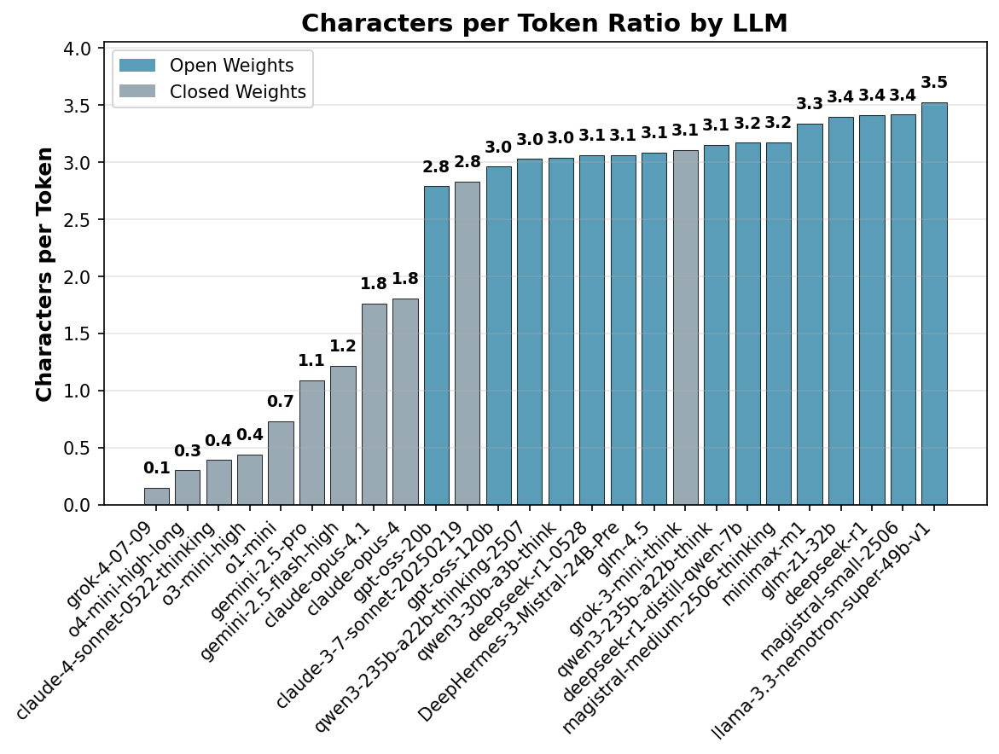
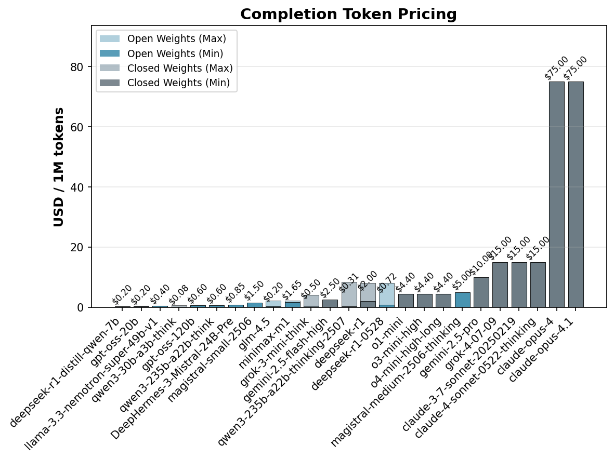
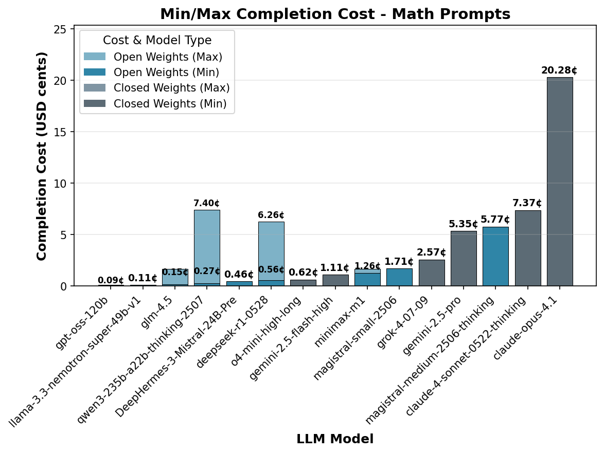

# Do Open Weight Reasoning Models Think Less Efficiently?

There has been remarkable advancement in Large Reasoning Models (LRMs) recently, resulting in both open weight and closed weight models. These models employ a novel paradigm known as test-time scaling, leveraging reinforcement learning to generate extended chains of thought (CoT) during reasoning tasks. This enhances their problem-solving capabilities beyond what their base models could achieve independently.

While cost and efficiency trade off curves  ("the pareto frontier") typically focus on model intelligence versus cost per million completion tokens, token efficiency — the number of tokens used for reasoning relative to the solution — is a critical factor that is recently receiving more attention. 

Anecdotal evidence suggests open weight models produce significantly more tokens for similar tasks than closed weight models. This report systematically investigates these observations.

## Why is it of interest to measure token efficiency?

Token efficiency is a critical metric for several practical reasons:

First, while hosting open weight models may be cheaper, this cost advantage could be easily offset if they require more tokens to reason about a given problem. Second, an increased number of tokens will lead to longer generation times and increase latency. Finally, inefficient token usage may exhaust the available context window, limiting the model's ability to process complex queries effectively.

Our investigation addresses three key questions:

1. Do open weight models systematically require more tokens than closed weight models for comparable tasks?
2. What are the cost implications when token efficiency is factored into total inference expenses?
3. Are there specific task categories where this efficiency gap is more pronounced?

## How can we measure token efficiency? 

Measuring the length of the thinking process, the Chain-of-Though presents some issues, because most recent closed source models will not share their raw reasoning traces. Instead, they use smaller language models to transcribe the chain of thought into summaries or compressed representations. This means the original reasoning process remains hidden, with only the final answer and a transcribed version of the CoT available for analysis.

However, since models are usually billed by the number of output tokens for the full prompt completion (thinking and final answer output), we can use the number of completion tokens as a proxy for the total effort required to generate an answer.

To investigate which models transcribe the CoT and which make them directly available, we analyzed the relationship between total characters for completion (the sum of thinking trace and final output) versus the number of tokens billed for completion across all prompts in this study.

[Figure 1](#fig1) illustrates the relationship between total characters for completion (combining thinking trace and final output) versus the number of tokens billed for completion across all prompts in this study. Each model shows a linear relationship, but with different slopes depending on the specific model implementation.

[Figure 2](#fig2) presents the extracted slopes for each model, revealing interesting patterns. 

- **Open weight models** show a consistent character-to-token ratio of approximately 3-3.4, which is a typical token-to-character ratio of tokenizers. This suggests that no transcription took place for these models.
- **Claude 3.7 Sonnet** exhibits a ratio of 2.8, suggesting that the CoT is mostly intact, but the lower ratio my indicate that some filtering took place, possibly through simple word filtering or substitution.
- **Gemini models** show a slope of ~1, which suggests a text densification ratio of 3:1. While the original CoT is not available, the output remains proportional to chain of thought length and should reflect the reasoning process.
- **OpenAI and Claude models** show a ratio of 0.3, with closer examination of the scatter plot revealing that character count doesn't increase with CoT length, suggesting only a summary of the entire CoT is provided rather than transcription. This behavior seems to be specific to chat completions, as a continuous update is seen in streaming mode.

Some models also provide information about reasoning tokens as part of the API response. However, we found this number to be unreliable in many cases as some models (Claude) would only return the number of tokens of the transcribed CoT, while others would provide token counts that exceeded the total completion length. We introduced consistency checks to decide how to extract the reasoning token count, as described in the appendix.

Based on these findings, we use completion tokens to assess overall effort, supplemented by reasoning tokens from APIs where available.

## Dataset

  - To investigate token efficiency, a dataset was carefully curated with prompts the represent different workloads:
    - *Knowledge questions*: These can be answered in one sentence from the models pre-training corpus and usually no reasoning is required. 
    - *Math problems*: Most reasoning models are especially trained for math benchmarks, so they usually perform well on math problems. A subset of AIME problems was used.
    - *Logic puzzles*: These are problems that require logical understanding and reasoning.
  - All prompts were selected to complete below 30000 tokens to avoid truncated responses.

## Model selection

## Results 

### Knowledge questions

This part of the evaluation consists of 5 trivial knowledge questions that can be answered in one word and that do not require reasoning at all. 

> What is the capital of Australia?

> How many days are there in February during a leap year?

All models were able to responds to these prompts correctly. The purpose of these questions is to probe for superfluous reasoning. Efficient models should be able to determine that no reasoning is required.

[Figure 3](#fig3) shows the average number of reasoning and output tokens for each prompt. We can see, that on average, reasoning models spend hundreds of tokens pondering simple knowledge questions.

 

Resolving this per model reveals stark differences. [Figure 4](#fig4) shows that closed-weight frontier lab models are far more token efficient than open weight models.

To better quantify the excess token ratio, we normalized the token count for each prompt relative to the most optimized closed weight models (reference). This approach does consider the excess token ratio for all prompt equally,  which is in contrast to averaging across all completion lengths, which would be dominated by long completions.

[Figure 5](#fig5) shows the mean excess token ratio for different llm. The recently released Magistral models are an extreme outlier with up to 10x excess tokens. We also see that most other open weight models show an excess token ratio of around 4, meaning that they use four times as many tokens as the most optimized closed weight models.

How does this affect inference costs? [Figure 6](#fig6) shows the mean cost per model for knowledge questions, based on minimum and maximum completion pricing on the OpenRouter API in July 2025. The better token efficiency of closed weight models mostly compensates for higher API pricing of those models.

 
### Math problems

Math problems are a core benchmark for reasoning capabilities. The prompts used in this study are from recent AIME competitions, selected to be solvable by current frontier models.

*AIME2025I Problem 2*

> Find the sum of all positive integers $n$ such that $n+2$ divides the product $3(n+3)(n^2+9).$

*AIME2025I P2 Modified*

> Find the sum of all positive integers $n$ such that $n+2$ divides the product $3(n+3)(n^2+7).$
> 

The figure above shows the average token composition across all models for various math prompts. As expected, these problems require a substantial number of reasoning tokens, often in the thousands, which is significantly more than for knowledge questions.

Success rates are high across the board for most models, especially for the closed-weight frontier models which solve all problems perfectly. Some open-weight models struggle with specific problems like "Integer pairs", indicating variability in their mathematical reasoning skills.

When we look at the relative completion tokens, a familiar pattern emerges. Open-weight models are generally less token-efficient. For instance, `magistral-small` and `magistral-medium` use over three times as many tokens as the most efficient models. In contrast, some open-weight models like `o4-mini-high-lo` and `deepseek-r1` demonstrate high token efficiency, comparable to closed-weight models.

The completion cost analysis for math prompts highlights the trade-offs between per-token price and token efficiency. While some open-weight models have low per-token costs, their higher token usage on these complex reasoning tasks can lead to overall costs that are competitive with, or even exceed, those of more token-efficient closed-weight models. For example, the cost for `claude-3-7-sonnet-20250219` is the highest, despite other Claude and Gemini models being more cost-effective.

### Logic puzzles

 A special challenge with logic puzzles is that they are often represented in pretraining data and hence the model may be able to answer them without reasoning. To avoid this, modified problems from the [misguided attention](https://github.com/cpldcpu/MisguidedAttention) dataset were used.

 # 

# Methods

## General

   - General: Models were accessed with Openrouter, except Deephermes via the Nous API and DeepSeek R1-524 via the Deepseek API.
   - Generations were limited to 30000 tokens and reasoning effort was set to "high" in the OR api. Some issues were encountered where models would time out before 30000 tokens were generated. In these cases, the query was restarted and the provider was adjusted, if needed.
   - Statistics is N=5 for each prompt/llm combination

## Acquiring response and thinking token data

 - For many models, the number of reasoning tokens is also directly provided by the API. However we found this number to be unreliable in some cases. For example, Anthropic models would only return the length of the transcribed CoT, not the actual CoT lengths. Other models would occasionally return CoT lengths that were longer than the total completion length. The evaluation scripts perform consistency checks to assess the validity of returned CoT lengths and fell back to estimated the CoT  length with one of the following formula: 
   - When CoT is not available: CoT tokens = Completion tokens - Answer length in characters / 3.1 
   - When CoT is available: CoT tokens = Completion tokens * Cot length in characters / completion length in characters

## Model pricing

 - The cost per in $/1M completion tokens was automatically extracted from the OpenRouter API for each model in July 2025, except for Deephermes3. A summary is shown in Fig A, which lists highest and lowest pricing per model. 

Research plan

Objectives:
- Understand the token efficiency of large reasoning models (LRMs), specifically whether there is a different in state of the art between open weight and closed weight models.
- Discuss implications on cost of ownership.
- Discuss some of the mechanisms, if possible.
- Discuss why potential differences exist.
- Derive recommendations for optimization for open weight LRMs.

Approach:
- Set up test environment to measure token efficiency based on select prompts and tokens reported for completion.
- Choose a limited set of suitable prompts:
  a) Representative of common use cases. (knowledge question) - 4
  b) Clean reasoning prompts (e.g. math problems) - AIMES 2025
  c) Misguiding prompts without solution (impossibe, model has to figure out when to stop) - 
  d) Misguiding prompts with a solution (Model has to sample distribution despite bias, but problem is solvable)

For evaluation, use the normalized ratio!
- Some prompts may generally elicit shorter answers. Using the ratio of median/mean may skew results!
